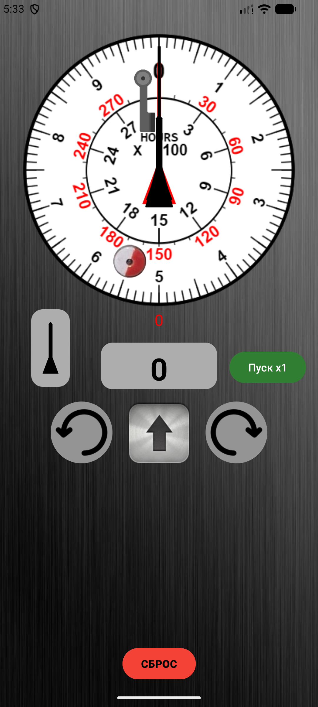

# ClockCounter

[License: MIT](https://img.shields.io/badge/License-MIT-yellow.svg)
[Platform](https://img.shields.io/badge/platform-Android-green.svg)

**ClockCounter** — Android-приложение для проверки показаний счётчика времени.

## Содержание

- [Описание](#описание)
- [Функциональность](#функциональность)
- [Скриншоты](#скриншоты)
- [Требования для сборки](#требования-для-сборки)
- [Сборка проекта](#сборка-проекта)
- [Запуск в Android Studio](#запуск-в-android-studio)
- [Тестирование](#тестирование)
- [Структура проекта](#структура-проекта)
- [Лицензия](#лицензия)
- [Автор](#автор)

## Описание

Приложение предназначено для работы со счётчиком времени: отображения текущего значения,
запуска/остановки отсчёта, сброса и выбора стрелок.

## Функциональность

- Отображение текущего значения счётчика времени.
- Запуск и остановка отсчёта.
- Сброс значения счётчика.
- Выбор стрелок.

## Скриншоты

На скриншоте — основной интерфейс приложения: отображение времени, кнопки старта/стопа,
кнопка выбора стрелок и сброса.

## Требования для сборки

Для сборки проекта требуется:

- [Android Studio](https://developer.android.com/studio);
- JDK, совместимый с используемой версией Android Gradle Plugin (рекомендуется JDK 17);
- Gradle Wrapper из проекта (отдельная установка Gradle не требуется);
- подключение к интернету для загрузки зависимостей из стандартных репозиториев.

Проект использует стандартные репозитории зависимостей:

- Google Maven Repository;
- Maven Central.

## Сборка проекта

1. Склонируйте репозиторий:

    git clone https://git@gitverse.ru:zoolbazuzu/Clock_Counter.git

2. Перейдите в папку проекта:

    cd Clock_Counter

3. Соберите debug-версию приложения.

    Для Windows (PowerShell):

    .\gradlew.bat assembleDebug

    Для Linux/macOS:

    ./gradlew assembleDebug

После успешной сборки APK-файл будет находиться примерно здесь:

app/build/outputs/apk/debug/

Для сборки release-версии используйте команду `assembleRelease` (требуется настроенная подпись).

## Запуск в Android Studio

1. Откройте Android Studio и выберите **Open**.
2. Укажите папку проекта `Clock_Counter`.
3. Дождитесь завершения синхронизации Gradle.
4. Подключите устройство или запустите эмулятор.
5. Нажмите **Run** (или `Shift + F10`).

## Тестирование

Запуск unit-тестов:

./gradlew test

Проверка кода линтером:

./gradlew lint

## Структура проекта

Clock_Counter/
├── app/                       # основной модуль приложения
│   ├── src/
│   │   ├── main/              # исходный код и ресурсы
│   │   │   ├── java/          # исходный код приложения
│   │   │   ├── res/           # ресурсы (layout, values, drawable)
│   │   │   └── AndroidManifest.xml
│   │   └── test/              # unit-тесты
│   ├── build.gradle           # конфигурация модуля
│   └── build/outputs/apk/     # собранные APK-файлы
├── docs/
│   └── screenshots/           # скриншоты приложения
├── gradle/                    # файлы Gradle Wrapper
├── build.gradle               # конфигурация проекта
├── gradlew / gradlew.bat      # скрипты запуска Gradle
├── settings.gradle
└── README.md

## Лицензия

Проект распространяется под лицензией [MIT](LICENSE).

## Автор

Степанов Алексей Александрович

- GitVerse: https://gitverse.ru/ZOOLBAZUZU
- GitHub: https://github.com/zool81-coder
